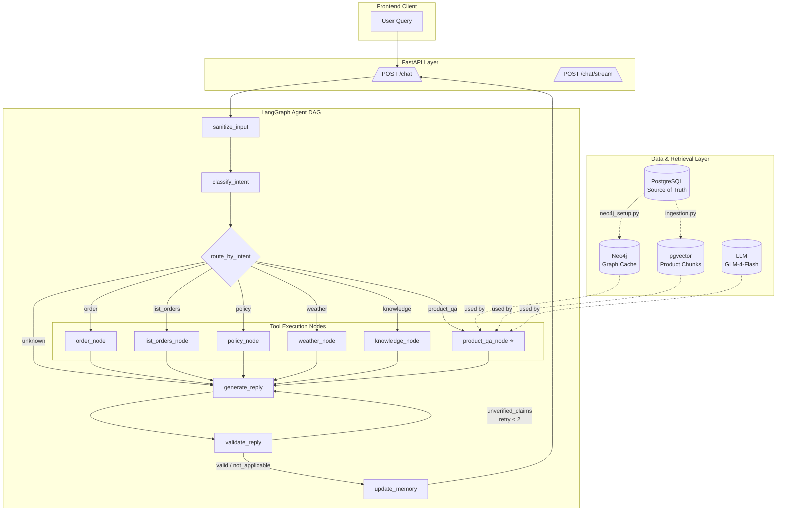
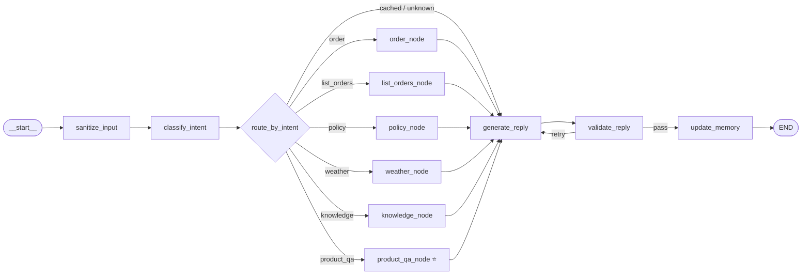
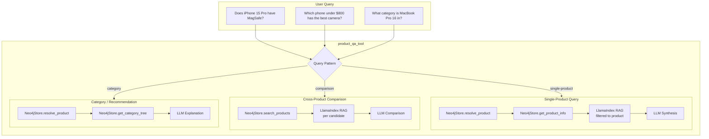
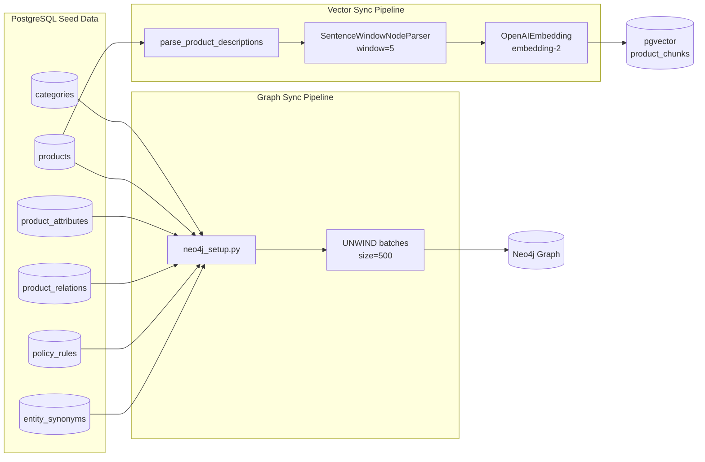
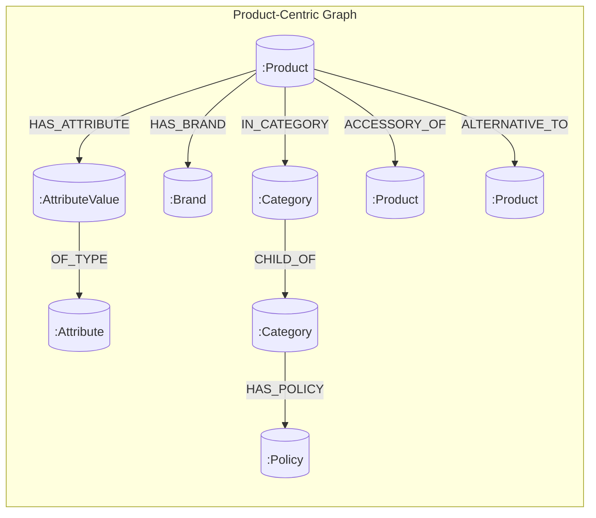
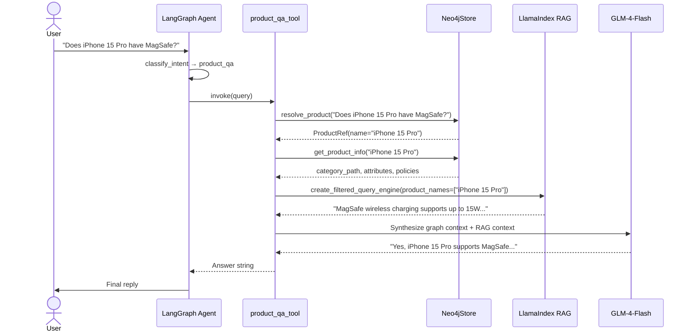
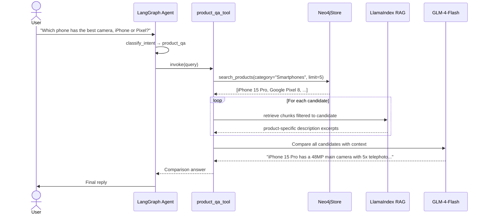
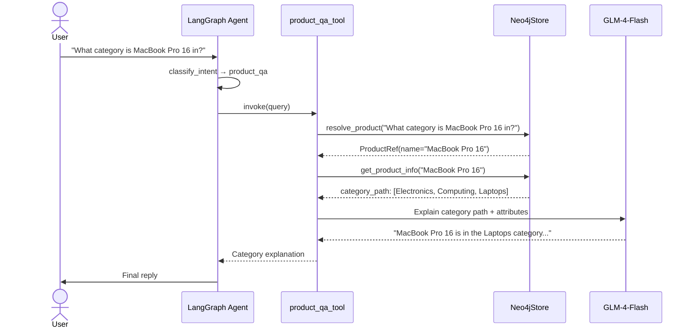

# Multi-Framework RAG + Knowledge Graph Architecture

## Overview

This diagram shows the complete architecture after integrating **Neo4j** (knowledge graph), **LlamaIndex** (RAG), and **LangGraph** (agent orchestration) into the existing e-commerce support backend.

---

## 1. End-to-End Request Flow

---

## 2. LangGraph StateGraph Detail

---

## 3. `product_qa_tool` Internal Orchestration

---

## 4. Data Sync Pipelines

### Neo4j Graph Schema

---

## 5. Component Responsibilities

| Component | Framework | Role | Data Source |
|-----------|-----------|------|-------------|
| `product_qa_node` | LangGraph | Agent node that routes `product_qa` intent | — |
| `product_qa_tool` | LangChain `@tool` | Orchestrates graph + RAG + LLM | Neo4j + pgvector + LLM |
| `Neo4jStore` | Neo4j driver | Typed Cypher queries (resolve, search, relations) | Neo4j |
| `neo4j_setup.py` | Neo4j driver | Batch-sync PG seed → Neo4j graph | PostgreSQL → Neo4j |
| `ingestion.py` | LlamaIndex | Parse descriptions → chunk → embed → store | `data/product_descriptions.txt` → pgvector |
| `query_engine.py` | LlamaIndex | Metadata-filtered vector retriever with sentence-window expansion | pgvector |
| `classify_intent` | Keyword + LLM | Detects `product_qa` intent from user query | — |

---

## 6. Vector Store Decision: pgvector vs. Milvus

| Dimension | pgvector (chosen) | Milvus |
|-----------|-------------------|--------|
| **Infrastructure** | Zero new services — reuse existing PostgreSQL container | Dedicated vector database (another container/service to ops) |
| **Scale ceiling** | Comfortable to ~1M vectors with HNSW index | Designed for 10M–1B+ vectors, distributed sharding |
| **Latency @ 30 products** | ~5–15ms | ~2–5ms (difference is noise at this scale) |
| **Operational overhead** | Same backup/restore/monitoring as PG | Separate backup strategy, SDK, auth, clustering |
| **Multi-modal / hybrid** | Basic; requires manual joins | Native hybrid search (vector + scalar + full-text) |
| **Team familiarity** | Team already runs PG + pgvector for policy embeddings | New toolchain to onboard |

**Why pgvector was the right call for this project:**

1. **Catalog size is tiny.** 30 products × ~20 sentence-window chunks = ~600 vectors. pgvector handles this in single-digit milliseconds. Milvus would be over-engineering by two orders of magnitude.
2. **Infrastructure consolidation.** The project already runs PostgreSQL for transactional data, LangGraph checkpointer, and the existing `store_policies` semantic cache (via `PGVector`). Adding Milvus means a second vector store to monitor, backup, and secure.
3. **No multi-modal need.** Milvus shines when you need to co-locate image embeddings, audio fingerprints, and text vectors with complex filtering. This project only has text product descriptions.
4. **When we *would* switch to Milvus:** If the catalog grows beyond ~10K products, or if we add visual search (image-based product lookup), or if latency becomes a bottleneck under high concurrency. At that threshold, the migration path is straightforward: re-run the LlamaIndex `ingestion.py` pipeline with a `MilvusVectorStore` instead of `PGVectorStore`.

**Bottom line for your boss:** Milvus is a great tool, but for a 30-product catalog inside an already-PostgreSQL-heavy stack, it adds operational complexity with no measurable latency or accuracy benefit. pgvector is the pragmatic choice until scale justifies the switch.

---

## 7. Three Query Patterns in Detail

### Pattern A: Single-Product Feature Query

### Pattern B: Cross-Product Comparison

### Pattern C: Category / Recommendation Query

